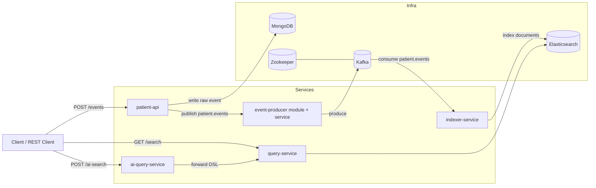

# MediStream

[](https://nodejs.org/)
[](https://expressjs.com/)
[](https://kafka.js.org/)
[](https://www.elastic.co/elasticsearch)
[](https://mongoosejs.com/)
[](https://www.docker.com/)

MediStream is a real-time medical event processing platform built as a backend portfolio MVP for a Node.js Engineer role in healthcare software.

It demonstrates:

- Event-driven microservices with Kafka
- Raw event persistence in MongoDB
- Search indexing in Elasticsearch
- AI-powered natural language search via LLM-generated Elasticsearch DSL
- Backend guardrails (validation, rate limiting, request IDs, dependency health checks)

## Architecture Diagram



## Tech Stack

- Runtime: Node.js 20+, ES modules
- API: Express
- Messaging: Kafka + KafkaJS
- Search: Elasticsearch + `@elastic/elasticsearch`
- Database: MongoDB + Mongoose
- AI integration: OpenAI or Anthropic (configurable)
- Infra: Docker Compose

## Quick Start

1. Create local env file:

```bash
cp .env.example .env
```

2. Start everything with one command:

```bash
docker compose up --build
```

3. Seed sample events:

```bash
node scripts/seed.js
```

4. Run request collection from `scripts/test-queries.http` (VS Code REST Client or similar).

## Services and Ports

- `patient-api`: `http://localhost:3001`
- `event-producer`: `http://localhost:3002`
- `indexer-service`: `http://localhost:3003`
- `query-service`: `http://localhost:3004`
- `ai-query-service`: `http://localhost:3005`
- Kafka broker host port: `9092`
- Elasticsearch: `http://localhost:9200`
- MongoDB: `mongodb://localhost:27017`

## API Documentation

### patient-api

- `POST /events`
  - Accepts patient event payload:

```json
{
  "patientId": "P-0001",
  "eventType": "lab_result",
  "severity": "warning",
  "department": "cardiology",
  "data": { "testName": "Troponin", "resultValue": 0.12 },
  "timestamp": "2026-02-20T14:30:00Z"
}
```

  - Guardrails:
    - strict whitelist fields only
    - strict enum validation for `eventType` and `severity`
    - `timestamp` must be valid ISO and not > 1 minute in future
    - `data` must be object and <= 50KB
    - rate limit: 100 req/min/IP

- `GET /events/:patientId`
  - Returns stored raw events for the patient (projected safe fields only).

- `GET /health`
  - Checks MongoDB + Kafka connectivity.

### event-producer

- `GET /health`
  - Checks Kafka producer/admin connectivity.

### indexer-service

- Kafka consumer of topic `patient.events`
- Indexes documents into Elasticsearch index `patient-events`
- Startup behavior:
  - ensures index exists
  - creates mapping with `dynamic: false` if absent
- Failure behavior:
  - retry indexing 3 times
  - on failure, publish to `patient.events.dlq`

- `GET /health`
  - Checks Kafka + Elasticsearch connectivity.

### query-service

- `GET /search`
  - Query params:
    - `q`, `eventType`, `severity`, `department`, `from`, `to`, `page`, `limit`
  - Elasticsearch timeout: 5 seconds
  - Pagination cap: `limit <= 100`

- `GET /search/aggregations`
  - Returns grouped counts by `severity` and `eventType`.

- `POST /search/dsl`
  - Executes validated Elasticsearch DSL passed from AI query service.

- `GET /health`
  - Checks Elasticsearch connectivity.

### ai-query-service

- `POST /ai-search`

```json
{ "query": "show me critical patients from cardiology this week" }
```

  - Guardrails:
    - strict whitelist (`query` only)
    - max 500 chars
    - rate limit 10 req/min/IP

  - LLM behavior:
    - system prompt forces JSON-only Elasticsearch DSL output
    - explicitly ignores instruction-injection in user input
    - includes index mapping in prompt
    - uses `max_tokens: 500`

  - Validation before forwarding:
    - parseable JSON required
    - allowed fields only (mapping-aware)
    - invalid output returns `422`

- `GET /health`
  - Checks query-service and LLM config state.

## Example AI Queries and Generated DSL

### 1) Query

`show me critical patients from cardiology this week`

Generated DSL example:

```json
{
  "query": {
    "bool": {
      "filter": [
        { "term": { "severity": "critical" } },
        { "term": { "department.keyword": "cardiology" } },
        {
          "range": {
            "timestamp": {
              "gte": "now-7d/d",
              "lte": "now"
            }
          }
        }
      ]
    }
  },
  "sort": [{ "timestamp": { "order": "desc" } }]
}
```

### 2) Query

`all lab results with warning severity today`

Generated DSL example:

```json
{
  "query": {
    "bool": {
      "filter": [
        { "term": { "eventType": "lab_result" } },
        { "term": { "severity": "warning" } },
        {
          "range": {
            "timestamp": {
              "gte": "now/d",
              "lte": "now"
            }
          }
        }
      ]
    }
  }
}
```

### 3) Query

`discharged patients from neurology last 48 hours`

Generated DSL example:

```json
{
  "query": {
    "bool": {
      "filter": [
        { "term": { "eventType": "discharge" } },
        { "term": { "department.keyword": "neurology" } },
        {
          "range": {
            "timestamp": {
              "gte": "now-48h",
              "lte": "now"
            }
          }
        }
      ]
    }
  }
}
```

## End-to-End Flow

`POST /events` -> Kafka `patient.events` -> `indexer-service` -> Elasticsearch -> `GET /search` / `POST /ai-search`

## Design Decisions

### Why Kafka instead of direct DB-only writes?

- Decouples ingest from downstream indexing/search.
- Buffers spikes and smooths backpressure across services.
- Enables replay and independent consumers (indexing, analytics, alerting) without changing ingest API.

### Why Elasticsearch instead of querying MongoDB for search?

- Supports full-text search and ranking better than document-store query patterns.
- Efficient aggregations/filtering for operational dashboards.
- Better fit for low-latency multi-filter search APIs.

### Why microservices instead of a monolith?

- Clear service boundaries map to real-world healthcare pipeline concerns (ingest, stream, index, query, AI orchestration).
- Independent scaling and failure isolation.
- Easier to evolve and replace components (LLM provider, indexing strategy, consumers) over time.

## Production Considerations

For production-hardening beyond this MVP:

- Authentication/authorization (JWT + service-to-service auth)
- HTTPS/TLS everywhere
- HIPAA-oriented audit logging and immutable access trails
- Schema registry and versioned event contracts
- Kafka topic retention/compaction policies + DLQ observability
- Circuit breakers + retries with backoff and idempotency keys
- Kubernetes deployment with autoscaling and rolling updates
- Centralized logs/metrics/tracing (OpenTelemetry + Prometheus/Grafana)

## Repository Structure

```text
.
├── patient-api/
├── event-producer/
├── indexer-service/
├── query-service/
├── ai-query-service/
├── shared/
├── scripts/
│   ├── seed.js
│   └── test-queries.http
├── docker-compose.yml
├── .env.example
└── ARCHITECTURE.md
```
